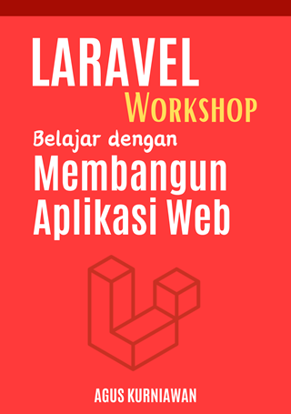

# Laravel Workshop: Belajar dengan Membangun Proyek Aplikasi Web

Dalam buku **Laravel Workshop: Belajar dengan Membangun Proyek Aplikasi Web**, pembaca diajak menyelami dunia pengembangan web dengan Laravel, salah satu framework PHP paling populer. Melalui 10 bab yang disusun secara sistematis dan 18 praktikum hands-on, buku ini memberikan panduan komprehensif untuk menguasai Laravel mulai dari dasar hingga tingkat lanjutan.

**Bab-Bab Buku**:
1. Pendahuluan dan Persiapan: Memperkenalkan Laravel dan persiapan lingkungan pengembangan.
2. Dasar-Dasar Laravel: Membahas konsep MVC dan struktur dasar Laravel.
3. Bekerja dengan Database: Teknik interaksi dengan database menggunakan Eloquent ORM.
4. Autentikasi dan Otorisasi: Implementasi fitur keamanan seperti autentikasi dan otorisasi.
5. Pengolahan Data Lanjutan: Menangani kasus kompleks dalam pengolahan data.
6. Pengembangan Front-End: Integrasi dan pengembangan antarmuka pengguna.
7. Keamanan Aplikasi: Praktik terbaik dalam mengamankan aplikasi Laravel.
8. Testing dan Debugging: Pengenalan dan penerapan testing serta debugging.
9. Peningkatan Kinerja Aplikasi Laravel dengan Redis dan Storage S3: Optimalisasi aplikasi dengan caching dan penyimpanan cloud.
10. Deployment dan Maintenance: Panduan deployment aplikasi dan perawatannya.

**Praktikum Hands-On**:
1. Hello World - Laravel: Membangun aplikasi Laravel pertama.
2. Membuat Web Registrasi: Pengembangan fitur registrasi pengguna.
3. Aplikasi Web Upload File Profile: Implementasi upload file.
4. Aplikasi Web dengan Session dan Cookie: Penggunaan session dan cookie.
5. Penerapan Redis untuk Session: Optimalisasi session dengan Redis.
6. Manajemen Produk dengan Laravel 10 dan MySQL: Pembuatan sistem manajemen produk.
7. Transaksi Database dengan Laravel 10 dan MySQL: Penggunaan transaksi database.
8. Penerapan Sistem Authentikasi pada Laravel: Membangun sistem autentikasi.
9. Mengirim Email dari Aplikasi Laravel: Implementasi pengiriman email.
10. Implementasi Email Verification dan Password Reset: Fitur keamanan email dan reset password.
11. Membuat Aplikasi CRUD dengan Relasi One-to-One Antar Tabel: CRUD dengan relasi tabel.
12. Membuat Aplikasi CRUD dengan Relasi One-to-Many Antar Tabel: CRUD dengan relasi tabel kompleks.
13. Integrasi Bootstrap ke dalam Aplikasi Laravel: Menggunakan Bootstrap untuk UI.
14. Integrasi Tailwind CSS ke dalam Aplikasi Laravel: Menggunakan Tailwind CSS.
15. Menulis dan Melakukan Unit Test serta Feature Test: Dasar-dasar testing.
16. Membuat dan Menjalankan Feature Test: Testing fitur aplikasi.
17. Implementasi Session dan Cache dengan Redis: Optimalisasi dengan Redis.
18. Implementasi File Storage Laravel dengan S3: Menggunakan AWS S3 untuk penyimpanan.

Buku ini dirancang untuk membekali pembaca dengan keterampilan yang dibutuhkan untuk membangun aplikasi web yang robust dan profesional dengan Laravel. Setiap bab dan praktikum dirancang untuk memberikan pengalaman belajar yang interaktif dan mendalam. Baik Anda seorang pemula yang ingin mempelajari Laravel dari nol atau pengembang yang ingin memperdalam keterampilan Anda, buku ini adalah sumber daya yang berharga.

## Cara Mendapatkan Buku Ini

Buku ini tersedia di toko buku ini:
* Google Play Books: [https://play.google.com/store/books/details?id=oczsEAAAQBAJ](https://play.google.com/store/books/details?id=oczsEAAAQBAJ)
* Lulu: [https://www.lulu.com/shop/agus-kurniawan/laravel-workshop-belajar-dengan-membangun-proyek-aplikasi-web/ebook/product-zmmvvj2.html](https://www.lulu.com/shop/agus-kurniawan/laravel-workshop-belajar-dengan-membangun-proyek-aplikasi-web/ebook/product-zmmvvj2.html?page=1&pageSize=4)